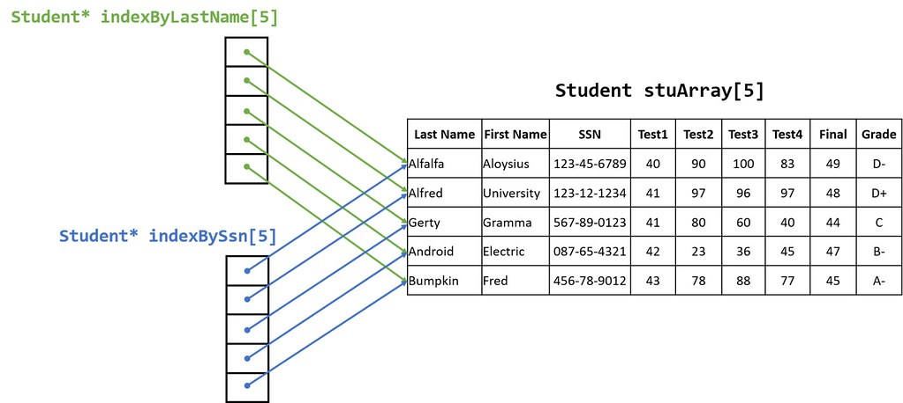
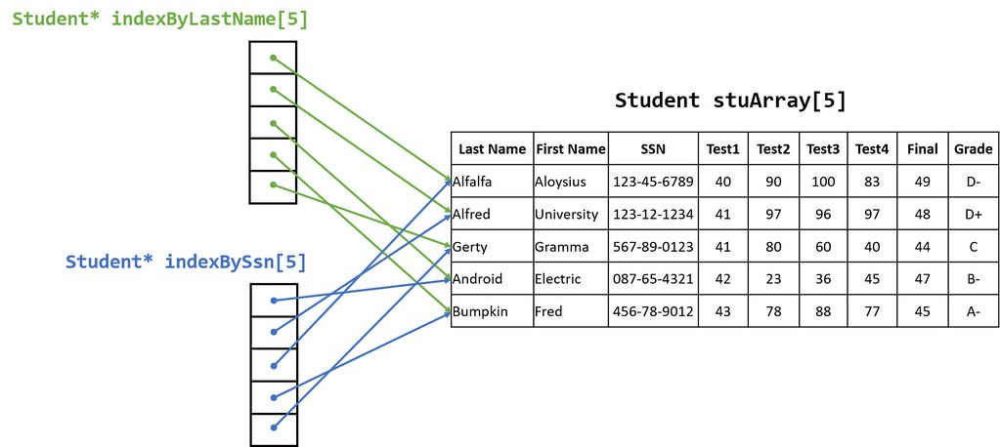

# PA2: Indexing with Pointers

### Learner Objectives
At the conclusion of this programming assignment, participants should be able to:
* Using pointers to indirectly sort an array or vector of structs 
* Search an item in an array or vector of structs

### Acknowledgements
Content used in this assignment is based upon information in the following sources:
* [CSV Files](https://people.sc.fsu.edu/~jburkardt/data/csv/csv.html) by John Burkardt

## Overview and Requirements
We should be familiar by now that if you want to find a piece of information, especially in large databases, you will have to go through each data. Searching can be made faster by sorting the data. 

Databases are just like csv files, where the columns represent the different fields and each row is an individual's record. As you should have observed in the previous lab, you may need to sort different columns depending on what you are searching for. 

In a real-world setting, when you visit a federal office. They might ask for your last name and first name to search for in the system. Or they could also ask for your social security number.  In 2018, the United States has a population of 327.2 million, so searching efficiently is really important. If you have to sort by last name, first name, and social security number, you should not have to sort them over and over depending on what field you are searching for.

For this programming assignment, you are going to implement indexing. **What is Indexing?** In databases, indexing makes columns faster to query or search because the indexes are in sequential order (i.e. sorted), however, it does not physically reorder data itself. One way this could be implemented is by using an array of pointers, where each pointer element is pointing to each record. Is the pointer array that is sorted instead of the records. You can create multiple indexes to allow sorted indexes for different fields.

### Watch Video About Indexing
In the programming assignment below, you are trying to implement multiple single-column indexes. Watch this [Youtube Video](http://www.youtube.com/watch?v=8oBKA4hU4xM) to learn about indexing and its application in databases.

## Program Details

Write a C++ program that will sort the table by the last name and by SSN using a dummy csv data. The user interacts with the program in the following manner:

**Step 1**: Show menu to the user, and prompt user to select from the menu. Ensure that the program validates user input. Prompt the user when an invalid menu option is selected.
```
1. Print data in ascending order by last name
2. Print data in ascending order by SSN
3. Search by last name
4. Search by SSN
5. Exit

Select a Menu: _
```
**Step 2**: If the user selects a valid menu, print out the output. For printing data, format the output using formatting options under <iomanip> for proper alignment.
```
Sorted by Last Name
ID  Last Name  First Name SSN         Grade
 9  Airpump    Andrew     223-45-6789 A
 1  Alfalfa    Aloysius   123-45-6789 D-
 2  Alfred     University 123-12-1234 D+
 4  Android    Electric   087-65-4321 B-
10  Backus     Jim        143-12-1234 A+
 8  Buff       Bif        632-79-9939 B+
 5  Bumpkin    Fred       456-78-9012 A-
11  Carnivore  Art        565-89-0123 D+
12  Dandy      Jim        087-75-4321 C+
17  de Paul    Martin     829-34-3412 B+
13  Elephant   Ima        456-71-9012 B-
14  Franklin   Benny      234-56-2890 B-
20  Garrett    Keith      723-35-9082 C+
15  George     Boy        345-67-3901 B
 3  Gerty      Gramma     567-89-0123 C
16  Heffalump  Harvey     632-79-9439 C
18  Madrigal   Jay        309-12-4312 F
 7  Noshow     Cecil      345-67-8901 F
19  Osborne    Demi       025-24-7821 A
 6  Rubble     Betty      234-56-7890 C-
```
**Step 3**: The program only exits when the user selects the correct menu to exit.


## Implementation Requirements
- [ ] Your program MUST use the three file structure. Create three files: `main.cpp`, `index.cpp` and `index.h`.
- [ ] Throughout the program development, commit your code frequently
    ```
    $ git add <NAME OF UPDATED FILE(S)>
    $ git commit -m "<COMMIT MESSAGE>"
    ```
- [ ] You **MUST** use data from `grades.csv`, thus part of your program will be loading data from this csv file.
- [ ] You will load the data from this file into an **array of structs** or **vector of structs**. I will leave this choice to you.
    ```cpp
    struct Student
    {
        int id;
        string lastName;
        string firstName;
        string ssn;
        float test[4];
        float final;
        string letterGrade;
    };
    ``` 
    > **IMPORTANT NOTE**: The order of each element in the array of structs as it was loaded from the file will never changed throughout the program. 
- [ ] Use two arrays of pointers to indirectly sort the data. This basically simulate the indexing of the data. 
    - [ ] Sort the data by the last name and 
    - [ ] Sort the data by SSN 

The diagrams below will demonstrate what the arrays of pointers would look like initially in the **Unsorted Indexing diagram** and what it would look like after it is sorted shown in the **Sorted Indexing diagram**. Although the diagrams only show an array size of 5, you MUST load all 20 data from the csv file.

### Unsorted Indexing


### Sorted Indexing


> **IMPORTANT NOTE**: After loading the data, then sorting the data by last name and SSN, **NO SORTING** will be executed after that. **Sorting is ONLY done once at the beginning.**
    
- [ ] **Menu options 3 to 4** will REQUIRE you do a **binary search** and search based on what the user is looking for. If the user asks for Gerty, then you need to display all of the data related to the person with the last name Gerty. For this binary search, you will have to use the array of pointers, as they represent the sorted representation of the data.

- [ ] Test your completed code thoroughly to ensure it is working correctly before proceeding to the next requirement.

- [ ] Implement a third array of pointers for indexing by the first name. Also, add additional menu options related to this.

- [ ] Test your code again to make sure everything works even with the new changes.

- [ ] Adhere to the [CS150/151 C++ Style Guide](https://github.com/nic-cs150-master/style-guide).
    - [ ] Make sure each source code file have file header comment. 
    - [ ] Add function header comments to each function. 
    - [ ] Also add inline comments in your code to describe sections and comment complex portions of your code.

- [ ] Refactor code if necessary.
    - [ ] Break it down further by creating new functions
    - [ ] Find areas of inefficiencies and see if you can rewrite code with a better approach
    - [ ] Test after each change to make sure program still works as intended
    
## Challenge Yourself Beyond The Scope of the PA (Not Required)
* I believe one important indexing not included in this PA is indexing for both Last Name and First Name combined, not separately.
    - [ ] Create a fourth array of pointers for indexing by lastname, firstname, sorted in descending order
    - [ ] User will be prompted for `Search for Full Name: Dandy, Jim`
    - [ ] Print out student information if found.
* Also think of situations on ways to address following issues
    - [ ] When multiple people have the same last names. What is the result of binary search?
    - [ ] When you have user who loves to write names all in lowercase letters, how can you make your program still work regardless of the letter case?
    - [ ] How about last names or first names with two word (e.g. de la Cruz), how can you make your program find de la Cruz, dela Cruz or delacruz?
* Think of other issues that you have experience yourself in applications you have used before.

## Submitting Assignments
1. Ensure that you `push` your local copy of this PA's repo to GitHub. Verify that the code in GitHub is the same code you have on your local computer.
2. You may continue to update and push your code into this repo as long as it is before the deadline.
3. It is VERY IMPORTANT that besides pushing the code to GitHub that you still submit the GitHub URL of this programming assignment in Canvas. This allows the instructor to be notified of your final submission and that you are ready for grading.

> **_NOTE: By submitting your code to be graded, you are stating that your submission does not violate the Academic Integrity Policy outlined in the syllabus._**
